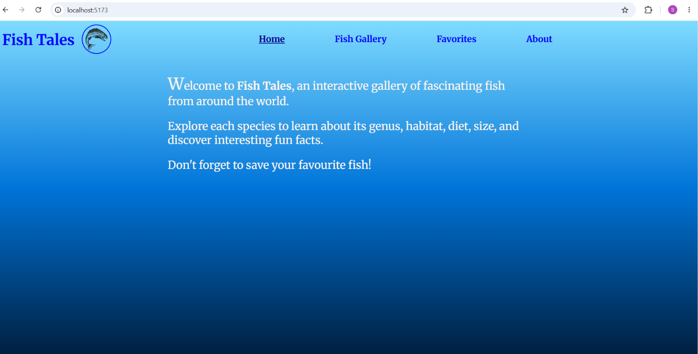
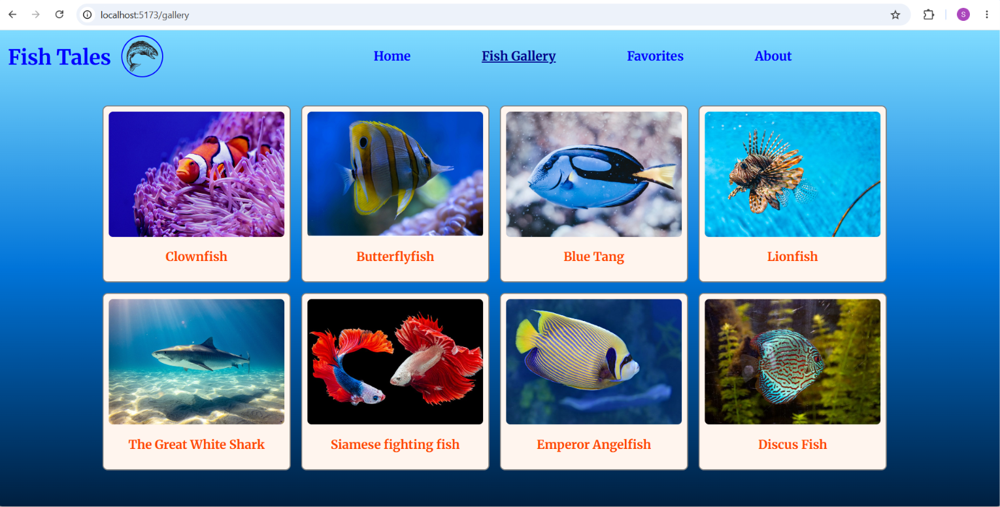
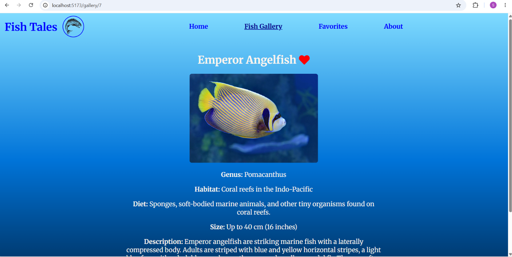
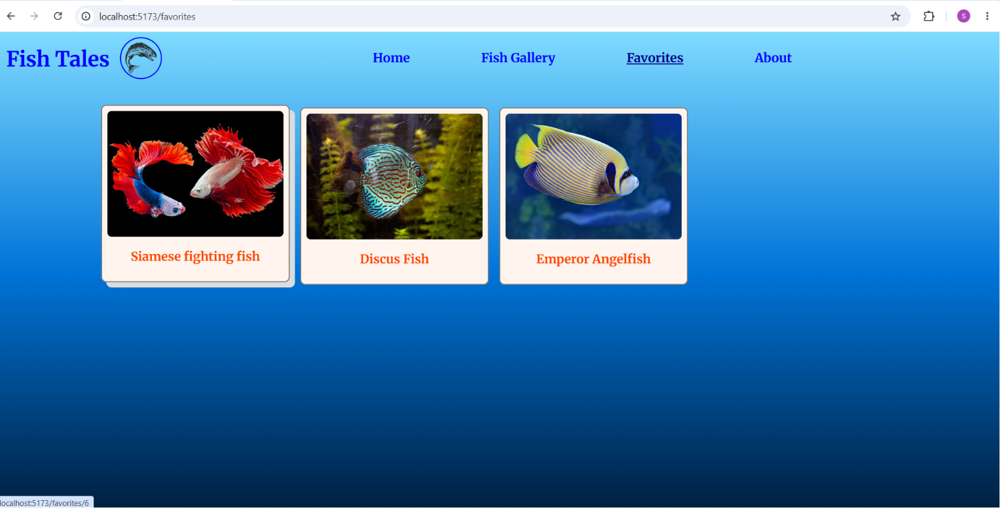

# Fish Tales

## Overview 

**Fish Tales** is an interactive React application that introduces a variety of fish species from around the world. Users can browse the fish gallery, view detailed information about each fish, add their favorite fish to a Favorites collection, explore their saved favorites, and remove fish from the Favorites list.

## Features

- 🐠 Browse a gallery of colorful freshwater and marine fish.
- 📖 View detailed information about each species.
- ❤️ Add and remove favorite fish using the Context API.
- 🗑️ Manage favorites with dedicated actions.
- 🔗 Navigate seamlessly using React Router.
- 📱 Responsive layout for desktop and mobile devices.

## Technologies Used

- React
- React Router
- Context API
- Vite
- CSS
- JavaScript

## Fish Collection

Fish Tales features a curated collection of vibrant freshwater and marine fish, each accompanied by a high-quality image and interesting facts about its habitat, diet, size, and unique characteristics. The combination of colorful visuals and informative content creates an engaging learning experience while showcasing the diversity of aquatic life.

## React Concepts Used

- React Router
  - Nested routes
  - Dynamic routes
  - Link
  - NavLink
  - useParams
  - useLocation
  - useNavigate
- Context API
- useState
- Component reuse
- Conditional rendering
- Passing data through location state
- UX decisions (heart vs. trash icon)
- Application architecture
- In-memory state vs. persistent data

## Project Structure

```text
fish-tales/
├── screenshots/      
│   ├── home.png
│   ├── fish-gallery.png
│   ├── fish-details.png
│   └── favorites.png
├── public/
├── src/
│   ├── assets/
│   │   └── images/
│   │       ├── betta.jpg
│   │       ├── blue-tang.jpg
│   │       ├── butterflyfish.jpg
│   │       ├── clownfish.jpg
│   │       ├── discus.jpg
│   │       ├── lionfish.jpg
│   │       ├── mandarin-fish.jpg
│   │       ├── shark.jpg
│   │       └── salmon.png
│   │
│   ├── components/
│   │   ├── FishCard.jsx
│   │   ├── FishCard.css
│   │   ├── Layout.jsx
│   │   ├── NavBar.jsx
│   │   └── NavBar.css
│   │
│   ├── data/
│   │   └── fishData.js
│   │
│   ├── pages/
│   │   ├── About.jsx
│   │   ├── About.css
│   │   ├── Favorites.jsx
│   │   ├── Favorites.css
│   │   ├── FishDetails.jsx
│   │   ├── FishDetails.css
│   │   ├── FishGallery.jsx
│   │   ├── FishGallery.css
│   │   ├── Home.jsx
│   │   ├── Home.css
│   │   ├── NotFound.jsx
│   │   └── NotFound.css
│   │
│   ├── App.jsx
│   ├── index.css
│   └── main.jsx
│
├── package.json
├── vite.config.js
└── README.md
```

## Application Functionality
### User Workflow

1. Launch the application and browse the Home page.
2. Navigate to the **Fish Gallery** to explore a collection of freshwater and marine fish.
3. Select any fish to view its detailed information, including its habitat, diet, size, description, and a fun fact.
4. Add or remove fish from the Favorites collection using the heart icon.
5. Open the **Favorites** page to view all saved fish.
6. Remove fish from the Favorites collection using the trash icon.
7. Navigate between pages using the navigation bar or the contextual **Back** link on the Fish Details page.

### Pages

* **Home** – Welcomes users and introduces the Fish Tales application.
* **Fish Gallery** – Displays all fish species in a responsive gallery layout.
* **Fish Details** – Shows detailed information about the selected fish, including its habitat, diet, size, description, and a fun fact. Users can also add or remove fish from their Favorites.
* **Favorites** – Displays all favorite fish selected by the user and allows them to remove fish from the Favorites list.
* **About** – Provides information about the project and its purpose.
* **Not Found** – Displays a friendly message when a user navigates to an invalid route.

### Components

* **Layout** – Provides the common page layout and renders nested routes using React Router's `Outlet`.
* **NavBar** – Displays the application title and navigation links.
* **FishCard** – A reusable component that displays a fish image and name and links to its details page.

### Data

* **fishData.js** – A local JavaScript data file containing an array of fish objects. Each object stores information such as the fish's name, scientific name, habitat, diet, size, description, fun fact, and image. The application renders dynamic content from this structured data without requiring an external API.

  The application currently includes **8 fish species**, each assigned a unique ID (1–8) for routing and data retrieval.

### Styling

* Each page and reusable component has its own dedicated CSS file to keep styles modular and maintainable.
* The application uses responsive design techniques to provide a consistent experience across desktop and mobile devices.
* Active navigation links are highlighted to indicate the current page.

## Additional Features

* Responsive design for desktop and mobile devices.
* Dynamic routing with React Router.
* Shared state management using the Context API.
* Active navigation link highlighting.
* Conditional rendering of heart and trash icons based on the navigation flow.
* Reusable `FishCard` component to avoid code duplication.
* Custom **Not Found** page for invalid routes.

## Data Flow

1. Fish information is stored locally in `fishData.js`.
2. The Fish Gallery renders fish cards by mapping over the data.
3. Selecting a fish navigates to its details page using a dynamic route (`/gallery/:id` or `/favorites/:id`).
4. Favorite fish are stored in React state and shared across the application using the Context API.
5. Components access and update the shared favorites state through `useContext`, ensuring the UI updates automatically when favorites are added or removed.

## Known Limitation

Favorites are stored in **React state** and shared across the components using the **Context API**. Since this is a frontend-only learning project, **the favorites list exists only for the current session.** **Refreshing the browser or directly entering a URL** resets the React state, causing the **favorites list to be cleared.**

In a production application, this data would typically be persisted using a backend database or browser storage such as `localStorage`.

## How to Run the Project

1. Clone the repository.
   ```bash
   git clone <repository-url>
   ```
2. Navigate to the project directory.
   ```bash
   cd fish-tales
   ```
3. Install the project dependencies.
   ```bash
   npm install
   ```
4. Start the development server.
   ```bash
   npm run dev
   ```
5. Open your browser and visit the local development URL displayed in the terminal. 

## Screenshots

### 🏠 Home



### 🐠 Fish Gallery



### 📖 Fish Details



### ❤️ Favorites



## Useful Resources

- [React Documentation](https://react.dev/)
- [React Router Documentation](https://reactrouter.com/)
- [Vite Documentation](https://vite.dev/)
-  [React Icons - Font Awesome](https://react-icons.github.io/react-icons/icons/fa/)
- [MDN Web Docs](https://developer.mozilla.org/)
- [Google Fonts](https://fonts.google.com/)
- [Wikipedia](https://www.wikipedia.org/) – Fish information and scientific references.
- [Unsplash](https://unsplash.com/) – Background images and photography.
